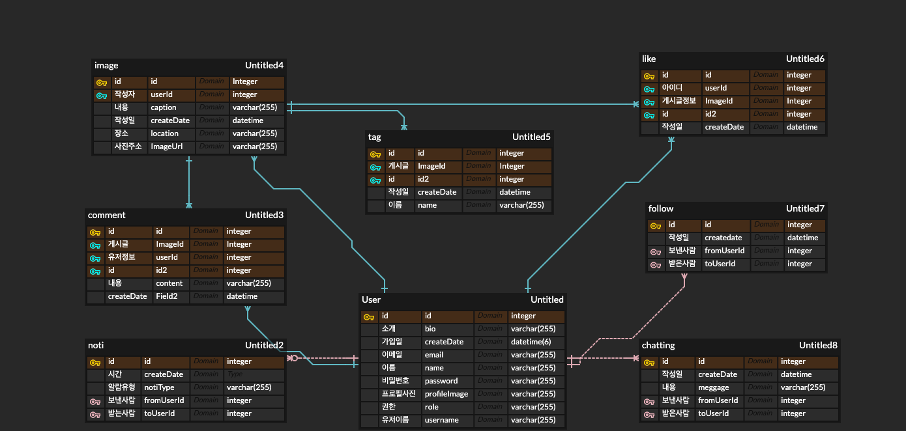
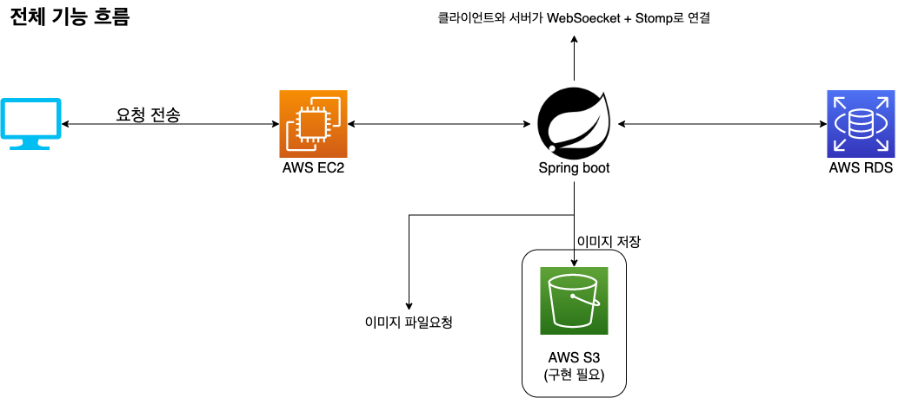

# Gryllo
- - -
## 1. ERD

- - -
## 2. 사용 기술

**Front-end**

 

**Back-end** 

           

- - -
## 3.아키텍처

- - -
## 4.주요기능
* 회원기능
    * 회원가입
    * 로그인
    * 회원정보수정
    * 팔로우
    * 메세지(채팅)
* 게시판
    * 검색
    * 해시태깅
    * 게시글 업로드
    * 좋아요
    * 댓글
    * 실시간 알람
  